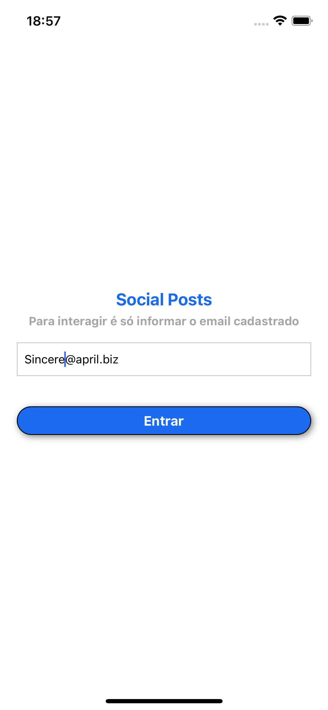
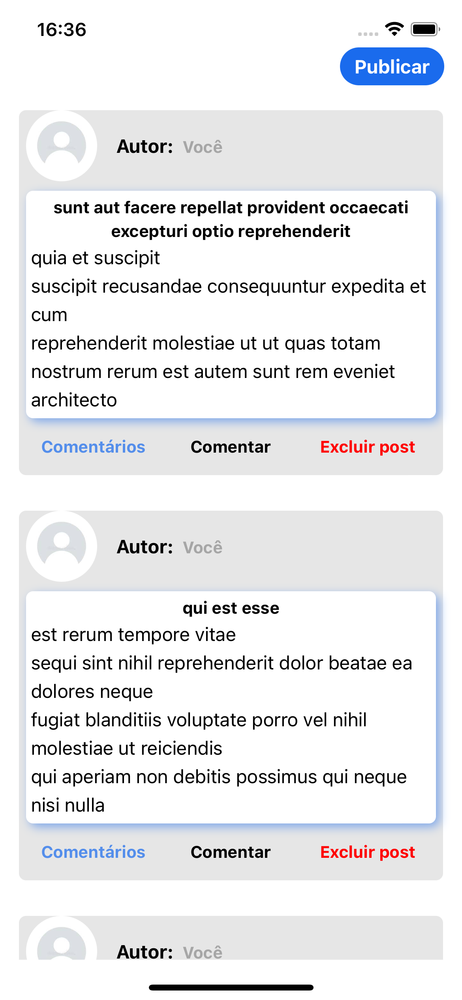
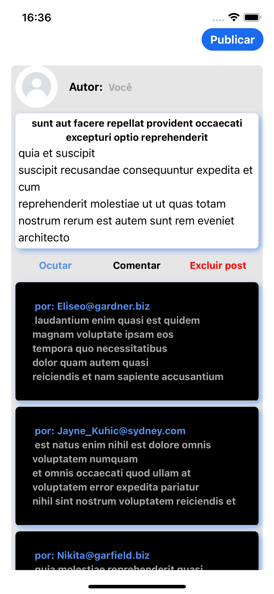

# APP POSTS

>**About this app**:
On this app, you can participate in a forum of posts, where you can create your own post and manage it. You just need to log in with your registerd email.

<p float="left">
  
  
  
</p>

###
- List of users you can log in with on the app, or check out this link: (https://jsonplaceholder.typicode.com/users)

Sincere@april.biz"
Shanna@melissa.tv",
Nathan@yesenia.net",
Julianne.OConner@kory.org",
Lucio_Hettinger@annie.ca",
Karley_Dach@jasper.info",
Telly.Hoeger@billy.biz",
Sherwood@rosamond.me",
Chaim_McDermott@dana.io",
Rey.Padberg@karina.biz",

## Running the app, Step 1: Start the Metro Server

First, you will need to start **Metro**, the JavaScript _bundler_ that ships _with_ React Native.

To start Metro, run the following command from the _root_ of your React Native project:

```bash
# using npm
npm start

# OR using Yarn
yarn start
```

## Step 2: Start your Application

Let Metro Bundler run in its _own_ terminal. Open a _new_ terminal from the _root_ of your React Native project. Run the following command to start your _Android_ or _iOS_ app:

### For Android

```bash
# using npm
npm run android

# OR using Yarn
yarn android
```

### For iOS

```bash
# using npm
npm run ios

# OR using Yarn
yarn ios
```
